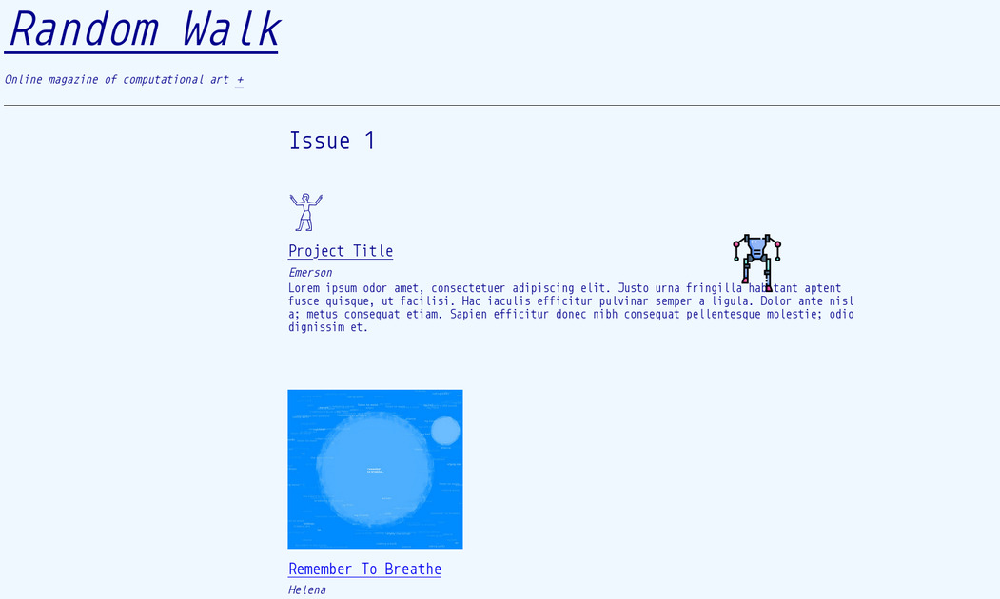

# Random Walk

Random Walk is an online magazine of computational art, organized by [Lee Tusman](https://faculty.purchase.edu/lee.tusman/) in the department of [New Media](https://www.purchase.edu/academics/new-media/) at Purchase College. Each issue features new computational media, responding to the particular constraints of presenting work within a web browser. The inaugural issue features work from students of Programming For Visual Artists, who created computational text and artwork using the p5.js library in Fall 2024.

Unless otherwise listed all works are copyright by their respective artists. Exoskeleton icon by Freepik. robo.wav by Sergenious from FreeSound, CC BY. Monoid typeface copyright (c) 2015, Andreas Larsen and contributors. The Random Walk website was designed by Lee Tusman and is Creative Commons licensed CC BY NC with attribution. 

## Duotone tool

Inside the tools folder is a mini CLI program to convert images to the thumbnail style for issue 1.

Run `./duotone path/to/inputfile path/to/outputfile` to convert an image or `./duotone --help` for usage info.

duotone requires imagemagick as a dependency. Tested with ImageMagick 7.1.1-36.
